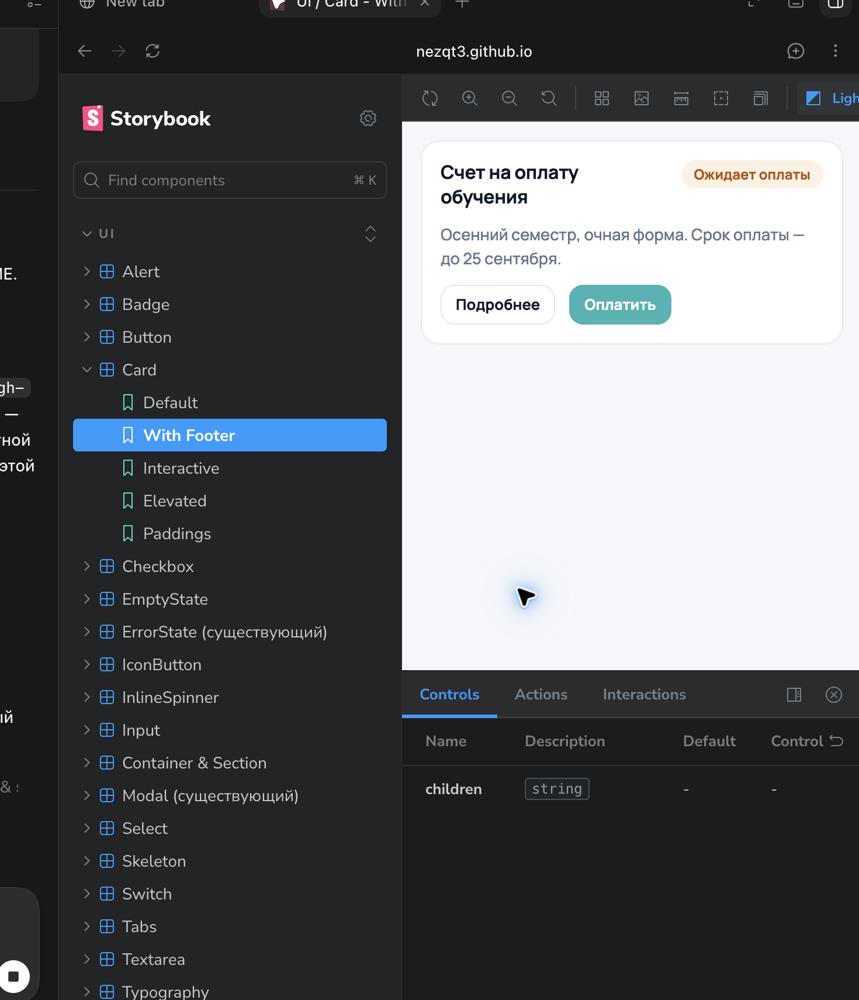

# Доступный вуз — UI Kit & Storybook

Публичная витрина дизайн-системы проекта **«Доступный вуз»** — цифровой
экосистемы университетских сервисов. Здесь собраны и задокументированы
переиспользуемые интерфейсные компоненты, на которых строятся пользовательские
сценарии платформы.

**[Открыть Storybook](https://nezqt3.github.io/accessible-university-storybook/)** ·
**[Открыть проект на GitHub](https://github.com/nezqt3/accessible-university-storybook)**

## Витрина компонентов

## Зачем это нужно продукту

Университетская платформа объединяет разные сервисы: расписание, профиль,
уведомления, студенческие сценарии и навигацию. Без единой системы компонентов
каждый новый экран начинает жить по собственным правилам: пользователю сложнее
ориентироваться, а команде — поддерживать и развивать интерфейс.

Этот Storybook превращает UI в общий контракт между дизайном, разработкой и
продуктом:

- **единый опыт** — знакомые паттерны и состояния повторяются во всех сервисах;
- **быстрее разработка** — готовые компоненты не нужно заново проектировать для
  каждого экрана;
- **проверяемая доступность** — интерактивные элементы и состояния можно
  отдельно проверить на понятность и удобство;
- **предсказуемое качество** — документация показывает варианты, ограничения и
  поведение компонента до интеграции в продукт.

## Что уже сделано

В Storybook представлены базовые блоки интерфейса и их состояния:

| Направление | Компоненты и сценарии |
|---|---|
| Действия пользователя | Button, IconButton, Switch, Checkbox |
| Работа с данными | Input, Select, Textarea, Tabs, FormField |
| Статусы и обратная связь | Alert, Badge, InlineSpinner, Skeleton, EmptyState, ErrorState |
| Композиция интерфейса | Card, Modal, Container, Section, Typography |

Для компонентов показаны варианты отображения: размеры, темы, состояния
загрузки и ошибок, disabled-режимы, иконки, подсказки и интерактивные сценарии.
Это позволяет команде выбрать нужный паттерн ещё до разработки конкретного
экрана.

## Моя роль

Я развивал **frontend-часть** «Доступного вуза»: проектировал и реализовывал
переиспользуемые UI-компоненты, их состояния и API, а также оформил их
документацию в Storybook. Моя цель — чтобы новые продуктовые сценарии собирались
быстрее, выглядели целостно и оставались удобными для разных групп пользователей.

## Технологии

`React` · `TypeScript` · `Storybook` · `Vite` · `SCSS` · `Redux Toolkit` ·
`RTK Query` · `Jest` · `Testing Library`

## О проекте «Доступный вуз»

«Доступный вуз» — платформа, которая собирает университетские сервисы в одной
точке входа. UI Kit помогает масштабировать продукт: подключать новые разделы
без потери визуальной целостности и поддерживать понятный интерфейс для
студентов, преподавателей и сотрудников.

Исходный код основной платформы не публикуется; этот репозиторий намеренно
открыт как самостоятельная демонстрация подхода к компонентной архитектуре и
документации интерфейсов.

---

Проект: «Доступный вуз» · Публичная документация компонентов
